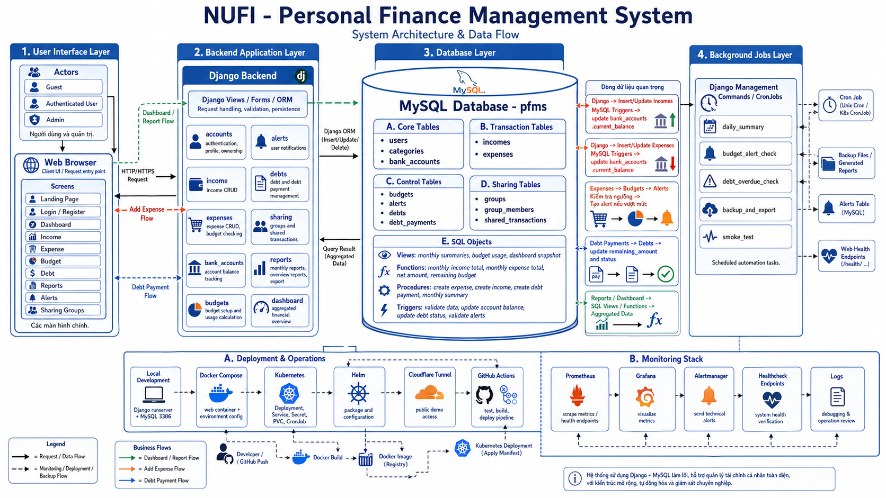

# NUFI — Personal Finance Management System



## Overview

NUFI is a personal finance web application built with **Django 6 + MySQL 8**, containerized with Docker, and deployable to Kubernetes via Helm.

This is a **Database Management Systems** course project. The database is the core of the system — not just a storage layer. The schema makes use of primary keys, foreign keys, indexes, views, stored procedures, functions, and triggers. See [docs/specifications/](docs/specifications/) for full database documentation.

**Tech stack:** Django · MySQL 8 · Docker · Gunicorn · Kubernetes + Helm · GitHub Actions CI/CD

---

## Prerequisites

| Tool | Version | Required for |
|---|---|---|
| Python | 3.11+ | Local development |
| MySQL | 8.0+ | Local development with MySQL |
| Docker + Docker Compose | Latest | Docker setup |
| kubectl + Helm | Latest | Kubernetes deployment |

---

## Setup

### 1. Clone & Install

```bash
git clone https://github.com/thtrangnu/PERSONAL-FINANCE-MANAGEMENT-SYSTEM.git
cd PERSONAL-FINANCE-MANAGEMENT-SYSTEM

python3 -m venv .venv
source .venv/bin/activate
pip install -r requirements.txt
```

### 2. Configure Environment

**Local (Django direct):**

```bash
cp .env.example .env
```

Edit `.env` with your settings. Minimum required:

```env
SECRET_KEY=your-secret-key
DEBUG=True
DB_ENGINE=mysql
DB_NAME=pfms
DB_USER=root
DB_PASSWORD=your_password
DB_HOST=127.0.0.1
DB_PORT=3306
```

**Docker Compose:**

```bash
cp .env.docker.example .env.docker
```

### 3. Initialize Database

```bash
# Run migrations
python manage.py migrate

# Create admin account
python manage.py createsuperuser
```

**(Optional) Load SQL scripts for DBMS demo:**

```bash
mysql -u root -p < sql/schema.sql
mysql -u root -p < sql/functions.sql
mysql -u root -p < sql/triggers.sql
mysql -u root -p < sql/views.sql
mysql -u root -p < sql/procedures.sql
mysql -u root -p < sql/indexes.sql
mysql -u root -p < sql/sample_data.sql
```

> ⚠️ `schema.sql` contains `DROP DATABASE IF EXISTS pfms` — only run this when rebuilding the database from scratch.

### 4. Google OAuth (optional)

1. Go to [Google Cloud Console](https://console.cloud.google.com/) → APIs & Services → Credentials → Create OAuth 2.0 Client ID
2. Add authorized JavaScript origins and redirect URIs for each port you use:

```text
# Origins
http://127.0.0.1:8000
http://127.0.0.1:8001

# Redirect URIs
http://127.0.0.1:8000/accounts/google/login/callback/
http://127.0.0.1:8001/accounts/google/login/callback/
```

3. Copy the client ID and secret into your `.env`:

```env
GOOGLE_OAUTH_CLIENT_ID=your-client-id
GOOGLE_OAUTH_CLIENT_SECRET=your-client-secret
```

> Always use `127.0.0.1`, not `localhost` — NUFI redirects `localhost` to `127.0.0.1` automatically to avoid `redirect_uri_mismatch` errors.

---

## Quick Start

**Docker Compose (recommended):**

```bash
docker compose --env-file .env.docker up --build -d
```

Open: `http://127.0.0.1:8001/`
Admin: `http://127.0.0.1:8001/admin/` — default credentials: `admin / admin12345`

**Local with MySQL:**

```bash
python manage.py migrate
python manage.py runserver 127.0.0.1:8000
```

Open: `http://127.0.0.1:8000/`

---

## Running Locally

```bash
python manage.py migrate
python manage.py runserver 127.0.0.1:8000
```

---

## Project Structure

```text
PERSONAL-FINANCE-MANAGEMENT-SYSTEM/
├── apps/                  # Django apps: accounts, incomes, expenses, budgets, debts...
├── config/                # Django settings, URLs, wsgi/asgi
├── templates/             # HTML templates
├── sql/                   # Schema, views, functions, procedures, triggers, sample data
├── docker/                # Container entrypoint scripts
├── deploy/                # Helm chart, monitoring config, version registry
├── docs/
│   ├── architecture/      # System flow diagrams
│   ├── deployment/        # Kubernetes/Cloudflare deployment guides
│   ├── operations/        # Backup/restore, demo checklist
│   └── specifications/    # Business rules, schema, modules, roles
├── scripts/               # Smoke tests, alert watcher, demo helpers
├── image/                 # ERD and schema diagrams
├── generated_reports/     # Job output — not committed to Git
├── .github/workflows/     # CI/CD pipelines
├── Dockerfile
├── docker-compose.yml
├── requirements.txt
└── manage.py
```

---

## Environment Variables

| Variable | Default | Description |
|---|---|---|
| `SECRET_KEY` | — | Django secret key (**required**) |
| `DEBUG` | `True` | Set `False` in production |
| `ALLOWED_HOSTS` | `127.0.0.1,localhost` | Comma-separated allowed hosts |
| `TUNNEL_ALLOWED_HOSTS` | `.trycloudflare.com` | Additional wildcard hosts (e.g. `.up.railway.app`) |
| `DB_ENGINE` | `mysql` | Database engine (`mysql`) |
| `DB_NAME` | `pfms` | Database name |
| `DB_USER` | — | Database user |
| `DB_PASSWORD` | — | Database password |
| `DB_HOST` | `127.0.0.1` | Database host |
| `DB_PORT` | `3306` | Database port |
| `DB_UNIX_SOCKET` | — | MySQL Unix socket path (optional) |
| `REPORT_OUTPUT_DIR` | `generated_reports` | Local output directory for job files |
| `GS_BUCKET_NAME` | — | Google Cloud Storage bucket (optional) |
| `GOOGLE_OAUTH_CLIENT_ID` | — | Google OAuth client ID (optional) |
| `GOOGLE_OAUTH_CLIENT_SECRET` | — | Google OAuth client secret (optional) |
| `DJANGO_SUPERUSER_USERNAME` | — | Auto-create superuser on Docker start |
| `DJANGO_SUPERUSER_PASSWORD` | — | Auto-create superuser on Docker start |

---

## SQL Scripts

Located in [`sql/`](sql/). Run in this order when rebuilding the database from scratch:

| Order | File | Contents |
|---|---|---|
| 1 | `schema.sql` | Tables, PK, FK, constraints |
| 2 | `functions.sql` | Stored functions |
| 3 | `triggers.sql` | Triggers |
| 4 | `views.sql` | Views |
| 5 | `procedures.sql` | Stored procedures |
| 6 | `indexes.sql` | Additional indexes |
| 7 | `sample_data.sql` | Demo data |

For day-to-day Django use, `python manage.py migrate` is sufficient — the SQL scripts are for DBMS demonstration only.

---

## Scheduled Tasks

Implemented as Django management commands — no Airflow required.

```bash
python manage.py daily_summary
python manage.py budget_alert_check
python manage.py backup_and_export
```

In Docker:

```bash
docker compose --env-file .env.docker exec web python manage.py daily_summary
docker compose --env-file .env.docker exec web python manage.py budget_alert_check
docker compose --env-file .env.docker exec web python manage.py backup_and_export
```

Output is saved to `generated_reports/` and not committed to Git. In Kubernetes, these run as CronJobs defined in the Helm chart.

---

## Default Ports

| Port | Used for |
|---|---|
| `8000` | Local Django dev server (`runserver`) |
| `8001` | Docker Compose |
| `8002` | Kubernetes (`kubectl port-forward svc/nufi 8002:80`) |
| `3000` | Grafana |
| `9090` | Prometheus |
| `9093` | Alertmanager |

Keep ports consistent to avoid Google OAuth callback mismatches and smoke test failures.

---

## Deployment

| Target | How |
|---|---|
| **Docker Compose** | `docker compose --env-file .env.docker up --build -d` |
| **Kubernetes** | See [docs/deployment/kubernetes.md](docs/deployment/kubernetes.md) |
| **CI/CD** | See [.github/workflows/](.github/workflows/) |

---

## CI/CD

The repo has 5 GitHub Actions workflows. Each targets a different deployment scenario.

```
Push to main
    │
    ├── ci.yml ──────────────────────────────── Always runs
    │       Django check → migrate → jobs → Docker build
    │
    └── cd.yml ──────────────────────────────── Always runs after CI
            Build image → push to GHCR
                │
                └── ENABLE_K8S_DEPLOY=true? ── Helm deploy to Kubernetes
                                                (self-hosted runner only)
```

### Workflow reference

| File | Trigger | Runner | What it does |
|---|---|---|---|
| `ci.yml` | push to `main` | GitHub | Django check, migrate, run 3 scheduled jobs, build Docker image |
| `cd.yml` | push to `main` / manual | GitHub + self-hosted | Build & push image to GHCR; optionally deploy via Helm if `ENABLE_K8S_DEPLOY=true` |
| `cd-local.yml` | push to `main` / manual | self-hosted | Docker Compose redeploy on local machine or VPS |
| `cd-kubernetes.yml` | manual only | self-hosted | Build image locally, deploy Helm chart to local Kubernetes cluster |
| `daily-smoke.yml` | daily 00:00 UTC / manual | GitHub | HTTP smoke test against `SMOKE_BASE_URL` |

### Which workflow to use

- **Just want CI on every push** → `ci.yml` runs automatically, no setup needed.
- **Deploy via Docker Compose on your machine** → add a self-hosted runner, use `cd-local.yml`.
- **Deploy to Kubernetes with GHCR image** → set repo variable `ENABLE_K8S_DEPLOY=true`, `cd.yml` handles the Helm deploy.
- **Deploy to local Kubernetes without pushing to GHCR** → trigger `cd-kubernetes.yml` manually, it builds the image directly on the runner.
- **Monitor a live deployment daily** → set `SMOKE_BASE_URL` secret, `daily-smoke.yml` runs every night.

### Required secrets

| Secret | Used by |
|---|---|
| `SECRET_KEY` | `cd.yml`, `cd-local.yml`, `cd-kubernetes.yml` |
| `DB_NAME`, `DB_USER`, `DB_PASSWORD`, `DB_HOST`, `DB_PORT` | All CD workflows |
| `GOOGLE_OAUTH_CLIENT_ID`, `GOOGLE_OAUTH_CLIENT_SECRET` | All CD workflows |
| `SMOKE_BASE_URL` | `daily-smoke.yml` |
| `SMOKE_USERNAME`, `SMOKE_PASSWORD` | `daily-smoke.yml` (optional) |

Add secrets at: **GitHub repo → Settings → Secrets and variables → Actions**.

---

## Kubernetes

Kubernetes is the production-like deployment target for NUFI. The repo includes a Helm chart at `deploy/helm/nufi/` that packages the entire application stack.

**What the Helm chart provisions:**

| Resource | Purpose |
|---|---|
| `Deployment` | Runs Django + Gunicorn as pods |
| `Service` | Internal load balancer for the web pods |
| `Ingress` | Optional external HTTP routing |
| `Job` | Runs `migrate` once on deploy |
| `CronJob` | Runs `daily_summary`, `budget_alert_check`, `backup_and_export` on schedule |
| `CronJob` (optional) | Runs `mysqldump` to `.sql.gz` |
| `ServiceMonitor` | Tells Prometheus to scrape `/metrics` |
| `PrometheusRule` | Defines alert conditions |
| `ConfigMap` | Grafana dashboard definition |
| `PVC` | Persists `media/` and `generated_reports/` |

**Open the app after deploying:**

```bash
kubectl -n nufi port-forward svc/nufi 8002:80
```

Always use port `8002` to keep Google OAuth callbacks and smoke test URLs consistent. Full deployment steps: [docs/deployment/kubernetes.md](docs/deployment/kubernetes.md).

---

## Monitoring

When the Kubernetes monitoring stack is installed, NUFI exposes a `/metrics` endpoint that Prometheus scrapes automatically via `ServiceMonitor`.

**Three components work together:**

| Component | Role |
|---|---|
| **Prometheus** | Scrapes `/metrics` every 30s, stores time-series data, evaluates alert rules |
| **Grafana** | Reads from Prometheus, displays the NUFI dashboard with charts and status panels |
| **Alertmanager** | Receives firing alerts from Prometheus, deduplicates and groups them, exposes an API for the local watcher script |

**Open each component:**

```bash
# Grafana — dashboards and charts
kubectl -n monitoring port-forward svc/monitoring-grafana 3000:80

# Prometheus — raw metrics and PromQL queries
kubectl -n monitoring port-forward svc/monitoring-kube-prometheus-prometheus 9090:9090

# Alertmanager — active alerts
kubectl -n monitoring port-forward svc/monitoring-kube-prometheus-alertmanager 9093:9093
```

**Verify NUFI is being scraped:**

```promql
up{job="nufi"}
```

A result of `1` means the target is up. The NUFI dashboard is available at `http://127.0.0.1:3000/d/nufi-monitoring`.

**Receive desktop notifications for new alerts:**

```bash
.venv/bin/python scripts/alert_watcher.py
```

The watcher script polls Alertmanager and triggers a desktop notification (macOS Notification Center / Linux `notify-send`) when a new alert fires.

---

## Public Demo via Cloudflare Tunnel

The app runs locally or on Kubernetes and has no public IP by default. **Cloudflare Tunnel** creates a temporary public HTTPS URL pointing to your local port — useful for sharing a demo link without deploying to a cloud provider.

**When to use:** sharing a demo link with others, presenting to reviewers, or testing Google OAuth on a public URL.

### Quick tunnel (temporary URL)

1. Install `cloudflared`:

```bash
brew install cloudflared
```

2. Start the app (Docker or Kubernetes), then in another terminal:

```bash
# If running Docker Compose on port 8001
cloudflared tunnel --url http://127.0.0.1:8001

# If running Kubernetes on port 8002
cloudflared tunnel --url http://127.0.0.1:8002
```

3. Cloudflare prints a public URL:

```text
https://random-name.trycloudflare.com
```

Share this link — it works as long as both the app and the tunnel terminal are running.

### One-command demo (Kubernetes)

The repo includes a script that starts port-forward and tunnel together:

```bash
chmod +x scripts/run_public_demo.sh
./scripts/run_public_demo.sh
```

Press `Ctrl + C` to stop both.

### Limitations

| | Quick Tunnel | Named Tunnel |
|---|---|---|
| URL | Random, changes every run | Fixed custom domain |
| Google OAuth | ❌ Callback URL changes | ✅ Works with fixed domain |
| Setup | Zero config | Requires Cloudflare account + domain |
| Cost | Free | Free (domain cost only) |

For a demo that doesn't need Google OAuth, the quick tunnel is sufficient. For a stable URL across multiple demo sessions, set up a named tunnel with a custom domain on Cloudflare.

---

## Troubleshooting

**Web not responding on port `8000`**

```bash
python manage.py migrate
python manage.py runserver 127.0.0.1:8000
```

**Web not responding on port `8001` (Docker)**

```bash
docker compose --env-file .env.docker ps
docker compose --env-file .env.docker logs -f web
```

**Web not responding on port `8002` (Kubernetes)**

```bash
kubectl -n nufi port-forward svc/nufi 8002:80
```

**Prometheus target `nufi` is DOWN**

```bash
# Check in Prometheus at http://127.0.0.1:9090
up{job="nufi"}
# Then verify pod is running and ServiceMonitor is applied
kubectl -n nufi get pods
```

**Alertmanager / watcher not sending notifications**

```bash
.venv/bin/python scripts/alert_watcher.py --once
```

---

## Documentation

| Document | Description |
|---|---|
| [docs/specifications/project-overview.md](docs/specifications/project-overview.md) | Problem context, objectives, tech stack |
| [docs/specifications/business-rules.md](docs/specifications/business-rules.md) | 56 business rules (BR-01 – BR-56) |
| [docs/specifications/relational-schema.md](docs/specifications/relational-schema.md) | All 12 tables, PK/FK, indexes, views, triggers |
| [docs/specifications/system-requirements.md](docs/specifications/system-requirements.md) | FR/NFR requirements (FR-01 – FR-50) |
| [docs/specifications/modules.md](docs/specifications/modules.md) | 12 business modules and dependencies |
| [docs/specifications/roles-permissions.md](docs/specifications/roles-permissions.md) | 3-actor permission model |
| [docs/architecture/system-flow.md](docs/architecture/system-flow.md) | System flow diagrams (Mermaid) |
| [docs/deployment/kubernetes.md](docs/deployment/kubernetes.md) | Kubernetes + Helm deployment guide |
| [docs/operations/backup-restore.md](docs/operations/backup-restore.md) | Backup and restore procedures |
| [docs/operations/demo-evidence-checklist.md](docs/operations/demo-evidence-checklist.md) | Demo screenshot/video checklist |
