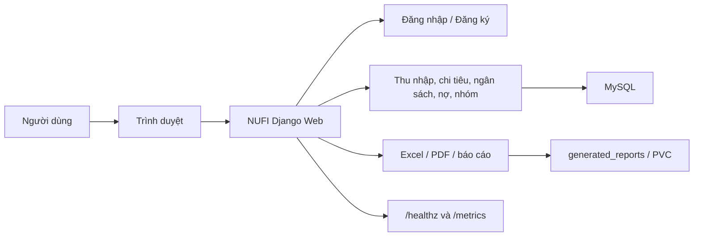
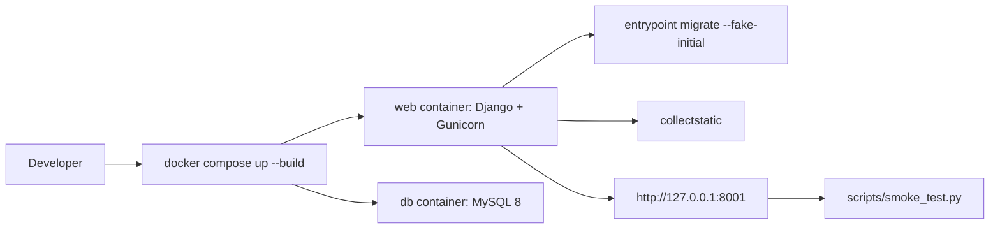
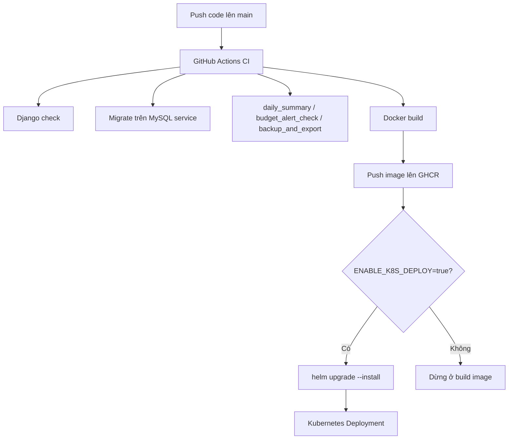
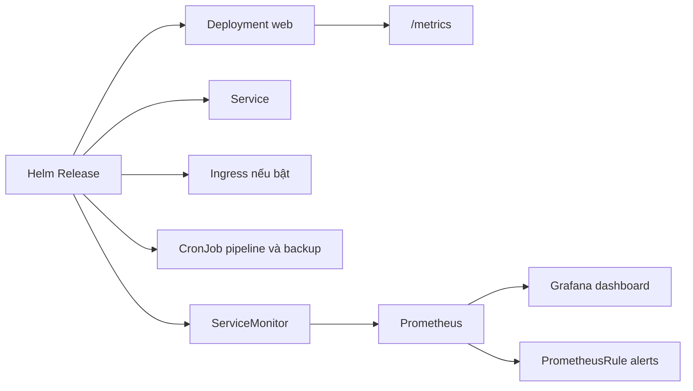
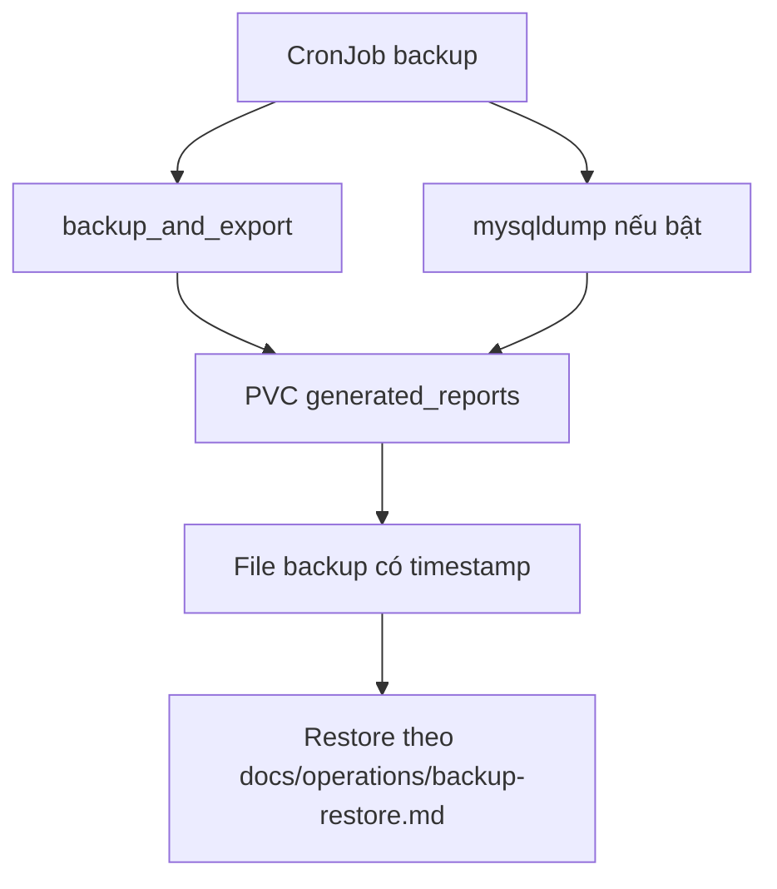

# NUFI System Flow

Tài liệu này dùng để giải thích luồng chạy tổng thể khi demo hoặc viết báo cáo.

## Luồng Ứng Dụng

## Luồng Docker Local

## Luồng CI/CD Trên Main

## Luồng Kubernetes Và Monitoring

## Luồng Backup Và Restore

