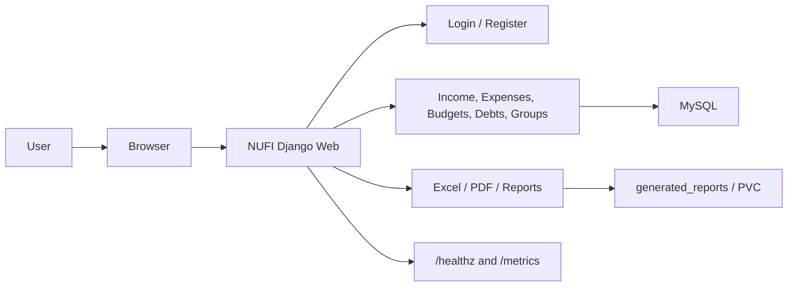
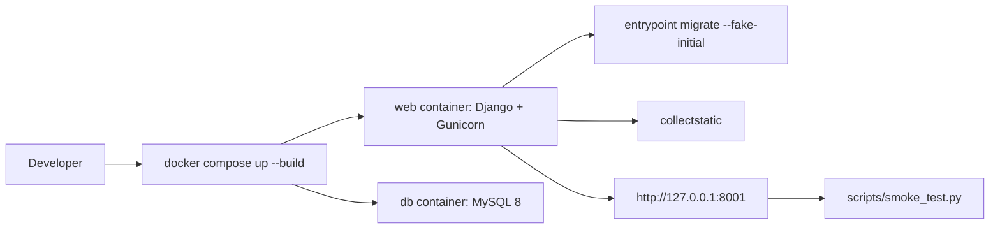
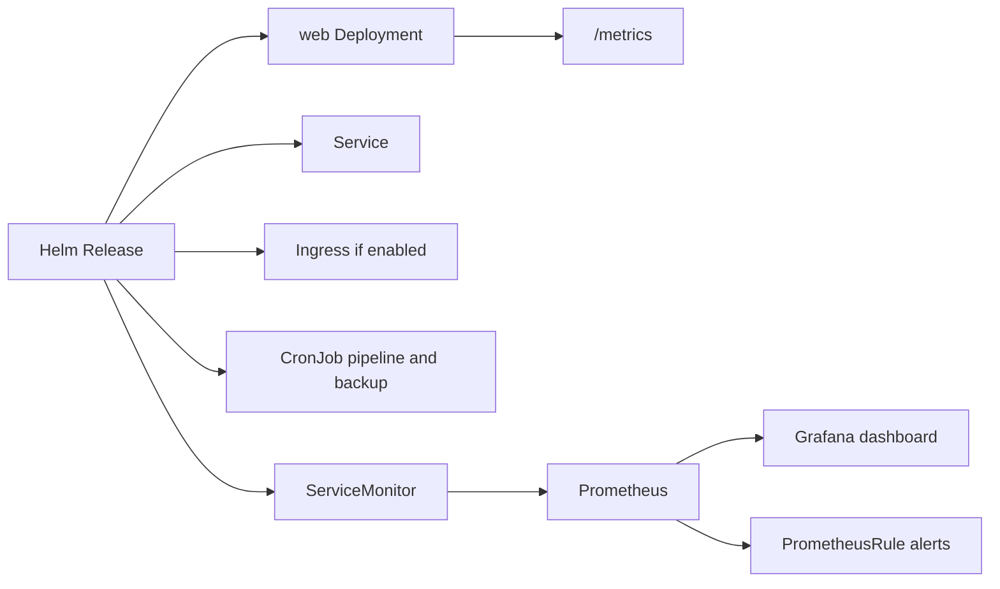
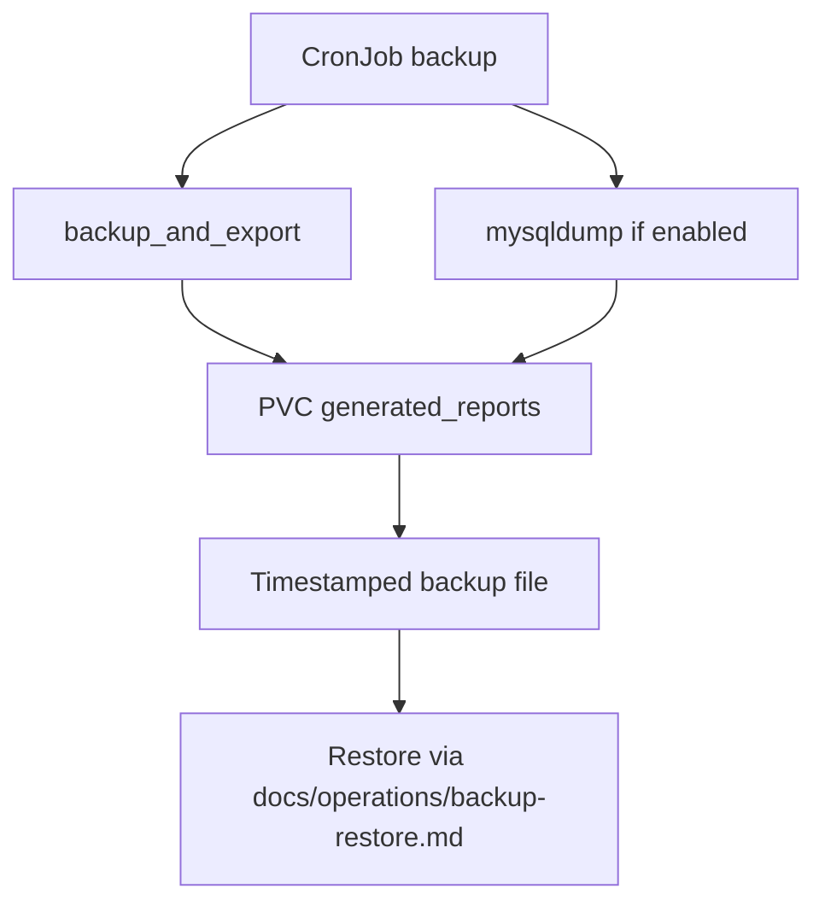

# NUFI System Flow

This document explains the overall system flow for demos and reports.

## Application Flow

## Local Docker Flow

## CI/CD Flow on Main

## Kubernetes and Monitoring Flow

## Backup and Restore Flow

